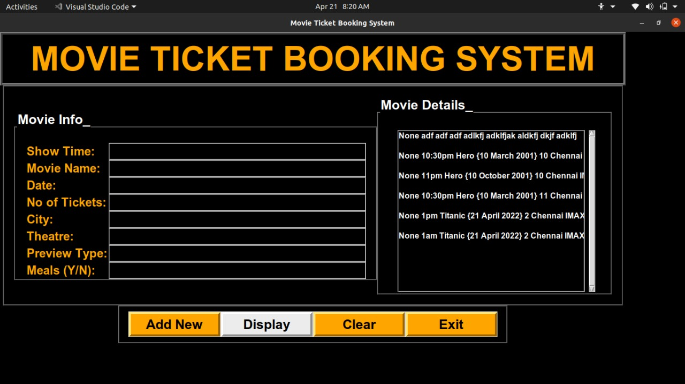

# Movie-Ticket-Booking-System

The main objective of the Movie Ticket Booking System is to manage the details of seats, booking, customer details, shows. The project is totally built at user end and thus only the administrator is guaranteed the access. The purpose of the project is to build an application program to reduce the work and time needed to go and book the tickets. It tracks all details about the same.

## Tech Stack 

Tech Stack used – 

                           Python
                           SQLite 3

Python modules used – 

                          Tkinter
                          Turtle
                          
## Features

### 1. ADD NEW

This feature enables the users to boo tickets for more than one movie at a time.

### 2. DISPLAY

This feature displays  history of all the tickets booked by the user so far.

### 3. CLEAR

To clear the entries given by the users.

### 4. EXIT

To exit the application.

## PREVIEW

